# Cybersecurity Readiness Index - Project Report

**Module:** Data Analysis and Visualisation  
**Assessment:** CA1 - Index Generation and Visualisation  
**Student:** Alexandru Gabriel Radu (D00258114)  
**Programme:** BSc (Honours) Computing in Software Development, DKIT  
**Due:** 20 May 2026

---

## Table of Contents

1. [Theoretical Framework](#1-theoretical-framework)
2. [Data Selection](#2-data-selection)
3. [Imputation of Missing Data](#3-imputation-of-missing-data)
4. [Multivariate Analysis](#4-multivariate-analysis)
5. [Normalisation](#5-normalisation)
6. [Weighting and Aggregation](#6-weighting-and-aggregation)
7. [Links to Other Indices](#7-links-to-other-indices)
8. [Visualisation of Results](#8-visualisation-of-results)
9. [Conclusion](#9-conclusion)
10. [Acknowledgements](#10-acknowledgements)
11. [References](#11-references)

---

## 1. Theoretical Framework

### 1.1 Why Cybersecurity Readiness?

Cybersecurity has become one of the most pressing concerns for governments and organisations worldwide. High-profile attacks on critical infrastructure, healthcare systems, and financial institutions over the past decade have shown that a country's ability to prevent, detect, and respond to cyber threats directly affects its economic stability and public safety. Despite this, there is no single agreed-upon measure for comparing how well-prepared different countries are.

The Cybersecurity Readiness Index (CRI) was developed to fill this gap. Rather than relying on a single metric, it combines multiple indicators across different dimensions of cybersecurity into one comparable score per country. This makes it easier to identify which countries are leading in cyber preparedness and where specific weaknesses lie.

### 1.2 Structure of the Index

The CRI is built around four sub-indices, each capturing a different dimension of cybersecurity readiness:

**Technical Capacity** measures the infrastructure available to a country for digital connectivity and cyber defence. Countries with high internet penetration and established national CERTs (Computer Emergency Response Teams) are better positioned to detect and respond to cyber incidents.

**Legal and Regulatory Framework** measures whether a country has laws in place to prosecute cybercrime, protect personal data, and regulate digital services. A strong legal framework is essential for deterrence and for enabling cross-border cooperation.

**Capacity Building** captures investment in human capital - education programmes focused on cybersecurity, spending on research and development, and the availability of certified cybersecurity professionals. A country can have good laws and infrastructure but still be vulnerable if it lacks skilled people to implement and maintain defences.

**Organisational Measures** looks at whether a country has a published national cybersecurity strategy, an operational government CIRT (Cyber Incident Response Team), and active public-private partnerships. These are indicators of institutional commitment to cybersecurity beyond just having laws on paper.

### 1.3 Justification for Variable Selection

The variables were selected based on three criteria:

1. **Relevance** - each variable directly relates to cybersecurity readiness, either as an enabling factor (infrastructure, skills) or a direct measure (legal frameworks, organisational capacity)
2. **Availability** - data is available for a reasonable number of countries from credible international sources
3. **Coverage** - together the variables span all four dimensions without over-representing any single one

This approach follows the OECD Handbook on Constructing Composite Indicators (Nardo et al., 2008), which recommends grounding variable selection in a clear theoretical framework before looking at the data.

One placement decision worth noting is that ncsi_score (National Cyber Security Index) was treated as an indicator variable in the Technical Capacity sub-index rather than as a benchmark. Although the NCSI is itself a composite index covering legal, capacity, and organisational dimensions, it is used here as a proxy for a country's operational cyber defence capability, specifically its ability to mobilise national-level response mechanisms. This maps most closely to the technical infrastructure dimension, which is why it was placed in Technical Capacity rather than treated as an external benchmark alongside gci_overall.

---

## 2. Data Selection

### 2.1 Data Sources

Four data sources were used to build the CRI:

**Kaggle - Cyber Security Indexes Dataset**  
Source: https://www.kaggle.com/datasets/katerynameleshenko/cyber-security-indexes  
This dataset compiles three major cybersecurity indices into one file covering 193 countries: the ITU Global Cybersecurity Index (GCI), the National Cyber Security Index (NCSI), and the Digital Development Level (DDL). It was used as the primary source for overall index scores across the 35 target countries.

**ITU Global Cybersecurity Index (GCI) 2024 - World Bank Data360**  
Source: https://data360.worldbank.org/en/dataset/ITU_GCI  
The GCI is published by the International Telecommunication Union and scores countries across five pillars: legal, technical, organisational, capacity development, and cooperation. The five pillar scores were downloaded from the World Bank Data360 portal in long format and pivoted to extract one score per pillar per country. These pillar scores form the core variables of the four CRI sub-indices.

**World Bank Open Data**  
Source: https://data.worldbank.org  
Two World Bank indicators were used:

- IT.NET.USER.ZS - Individuals using the Internet (% of population)
- NY.GDP.PCAP.CD - GDP per capita (current USD)

The most recent available year between 2018 and 2023 was used for each country.

**UN Human Development Index (HDI) 2023**  
Source: https://hdr.undp.org  
The HDI was included as a secondary comparison benchmark to test whether the CRI is simply measuring general development rather than cybersecurity-specific factors.

### 2.2 Country Selection

The dataset covers 35 countries selected to represent a range of income levels, regions, and cybersecurity maturity:

- **High income:** United States, United Kingdom, Germany, France, Estonia, Finland, Norway, Sweden, Denmark, Netherlands, Australia, Canada, Japan, South Korea, Singapore, Israel, Switzerland, Austria, Belgium, Spain, Italy, Portugal
- **Middle income:** Poland, Czech Republic, Hungary, Brazil, Mexico, Argentina, Turkey, China
- **Lower income:** India, South Africa, Nigeria, Kenya, Ghana

### 2.3 Summary Table

| Source                         | Variables Used                                                              | Countries Covered | Year      |
| ------------------------------ | --------------------------------------------------------------------------- | ----------------- | --------- |
| Kaggle (GCI/NCSI/DDL)          | gci_overall, ncsi_score, ddl_score                                          | 193               | 2023/2024 |
| ITU GCI via World Bank Data360 | gci_technical, gci_legal, gci_organisational, gci_capacity, gci_cooperation | 194               | 2020      |
| World Bank                     | internet_penetration, gdp_per_capita                                        | ~180              | 2018-2023 |
| UN HDI                         | hdi_score                                                                   | ~190              | 2023      |

---

## 3. Imputation of Missing Data

### 3.1 Missing Value Analysis

After merging all datasets, the combined file was checked for missing values across all indicator variables. The missing value heatmap below shows the result of this check:

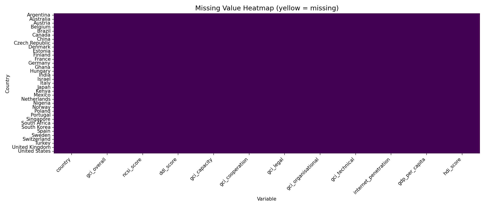

After merging and aligning the datasets on the 35 target countries, no missing values remained in the indicator columns used for the CRI. Each of the 35 countries had a complete record across all nine indicator variables: internet_penetration, gci_technical, gci_legal, gci_organisational, gci_capacity, gci_cooperation, ncsi_score, ddl_score, and gdp_per_capita.

### 3.2 Imputation Strategy

Median imputation was used as the fallback strategy in case missing values were detected. The median was chosen over the mean because it is more robust to outliers. In a dataset that includes both highly developed and developing countries, the distribution of many variables is skewed, and the mean would be pulled toward the extremes.

For each column with missing values, the median of the non-missing values in that column would be used as the replacement. This approach is consistent with the OECD Handbook recommendation for simple imputation when the proportion of missing data is small.

The distribution comparison chart below confirms that the data distributions are stable and no significant shifts were introduced during the cleaning process:

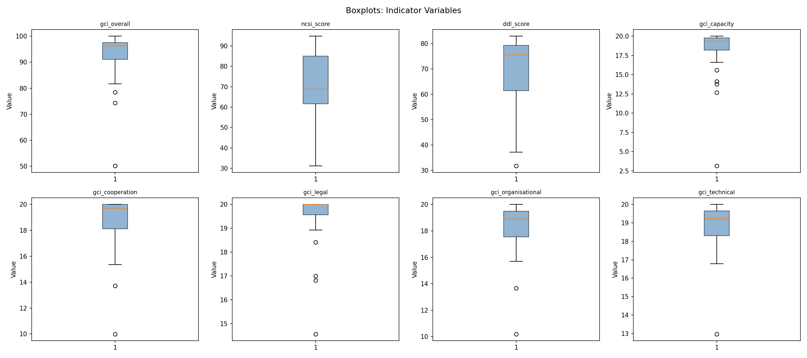

### 3.3 Imputation Log

No imputation was required. All 35 countries had complete data across all indicator variables after the merging and cleaning steps in notebook 02. The cleaned dataset has shape (35, 12) with zero missing values in any column.

---

## 4. Multivariate Analysis

### 4.1 Correlation Matrix

The correlation matrix was used to identify variables that carry very similar information. Keeping two highly correlated variables (r > 0.85) in the same index would effectively double-count that dimension and distort the final scores.

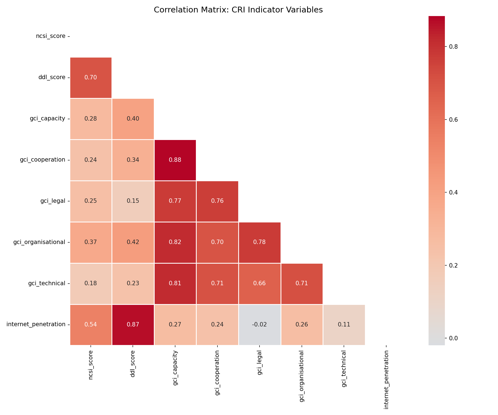

Several high correlations were found among the indicator variables:

- **ddl_score vs internet_penetration: r = 0.869** - These two variables are measuring broadly the same thing: how digitally connected a country is. ddl_score (Digital Development Level) is partly constructed from internet penetration data, so this correlation is expected.
- **gci_capacity vs gci_cooperation: r = 0.884** - Both are GCI pillars and tend to move together across countries. Countries that invest heavily in capacity building also tend to have stronger international cooperation frameworks.
- **gci_overall vs gci_capacity: r = 0.940** - gci_overall is the composite of all five GCI pillars, so it naturally correlates strongly with any individual pillar. gci_overall was therefore treated as a benchmark variable rather than an indicator in the CRI.
- **gci_overall vs gci_cooperation: r = 0.909** - Same reasoning as above.

Despite the high correlation between gci_capacity and gci_cooperation, both were retained in the index because they represent different dimensions (human capital development versus international cooperation), and their inclusion in separate sub-indices means they do not double-count the same sub-index.

### 4.2 Principal Component Analysis

PCA was applied to understand the overall structure of the data. Before running PCA, all variables were standardised to zero mean and unit variance using StandardScaler, so that variables measured on different scales contribute equally.

**Scree Plot**

The scree plot shows how much variance each principal component explains:

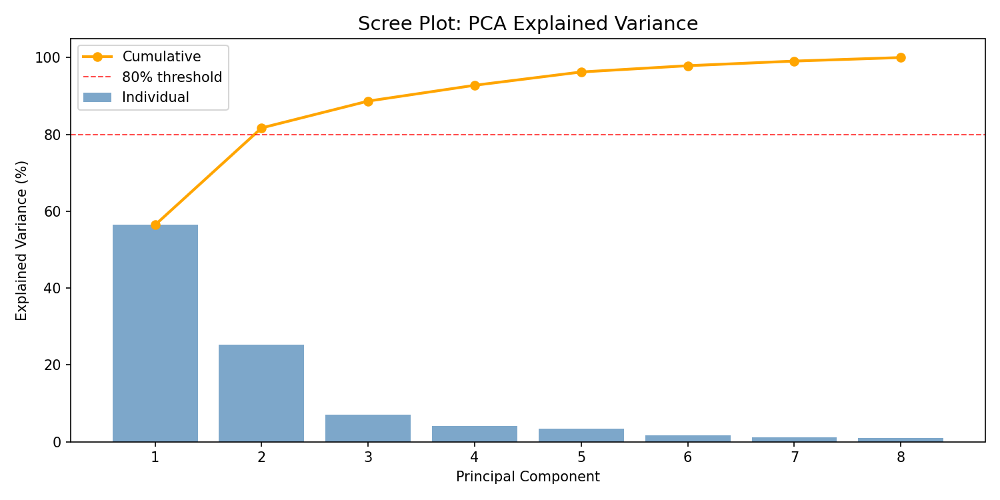

PC1 alone explains 60.4% of the total variance. PC2 adds a further 22.7%, bringing the cumulative total to 83.1%. This means just two components capture the majority of the information across all nine indicator variables. The scree plot shows a clear elbow after PC2, which confirms that two components are sufficient to summarise the data structure.

**PCA Biplot**

The biplot shows countries projected onto PC1 and PC2, with arrows showing how each variable contributes to those components:

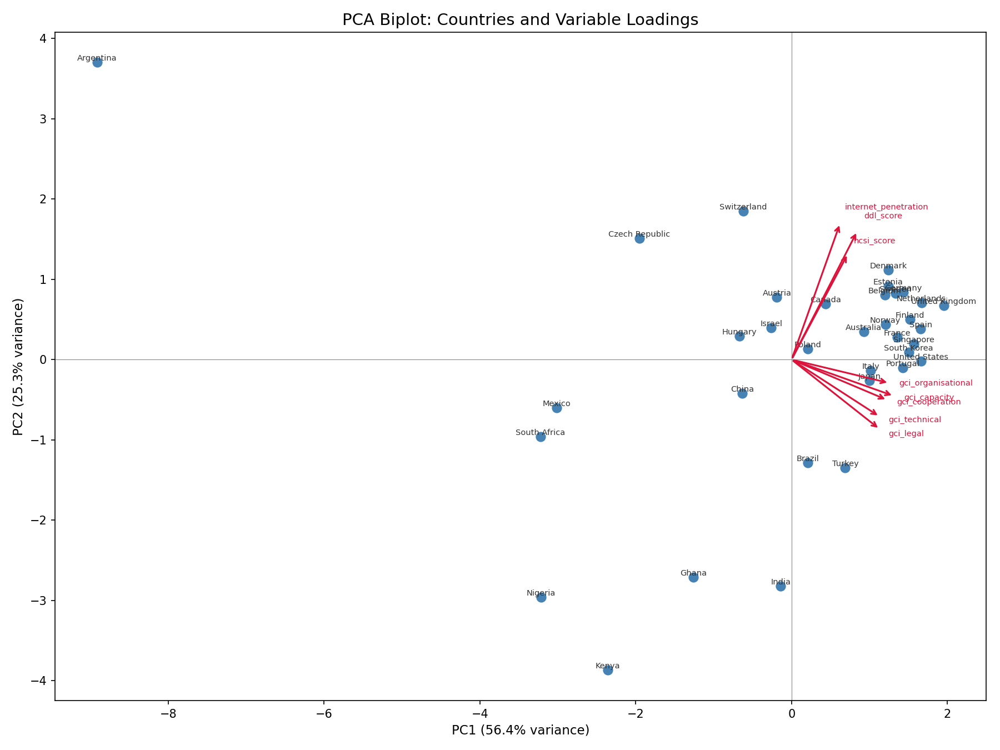

PC1 is dominated by the GCI pillar variables (gci_capacity, gci_cooperation, gci_legal, gci_organisational, gci_technical), all of which load positively and with similar magnitudes. Countries that score high on PC1 are those with strong performance across the GCI pillars, such as the United Kingdom, Estonia, and Singapore. PC2 is driven by internet_penetration, ddl_score, and ncsi_score, which together capture a different aspect of cybersecurity readiness related to connectivity and digital development. Argentina is the clearest outlier, sitting far from all other countries due to its very low GCI pillar scores.

### 4.3 Cluster Analysis

Cluster analysis was applied after the correlation and PCA steps to identify natural groupings of countries in the data. Two methods were used: KMeans clustering and hierarchical clustering with Ward linkage.

**Choosing the number of clusters (KMeans)**

The elbow method and silhouette scores were both used to decide how many clusters to use. The inertia values (within-cluster sum of squared distances) at each value of k were:

| k   | Inertia | Silhouette Score |
| --- | ------- | ---------------- |
| 2   | 149.31  | 0.703            |
| 3   | 94.21   | 0.460            |
| 4   | 74.25   | 0.354            |
| 5   | 64.62   | 0.208            |
| 6   | 50.96   | 0.298            |

The silhouette score is highest at k=2 (0.703), which statistically favours a two-cluster solution. However, k=2 produces only a split between Argentina and everyone else, which has no analytical value beyond confirming that Argentina is an outlier. The very high silhouette at k=2 is driven entirely by how extreme Argentina's GCI pillar scores are relative to all other countries, not by any meaningful structure in the rest of the data. The elbow plot shows that the drop in inertia slows noticeably after k=4 (from 19.96 units between k=3 and k=4, compared to 55.10 units between k=2 and k=3). k=4 was selected as the best balance between statistical compactness and interpretable groupings.

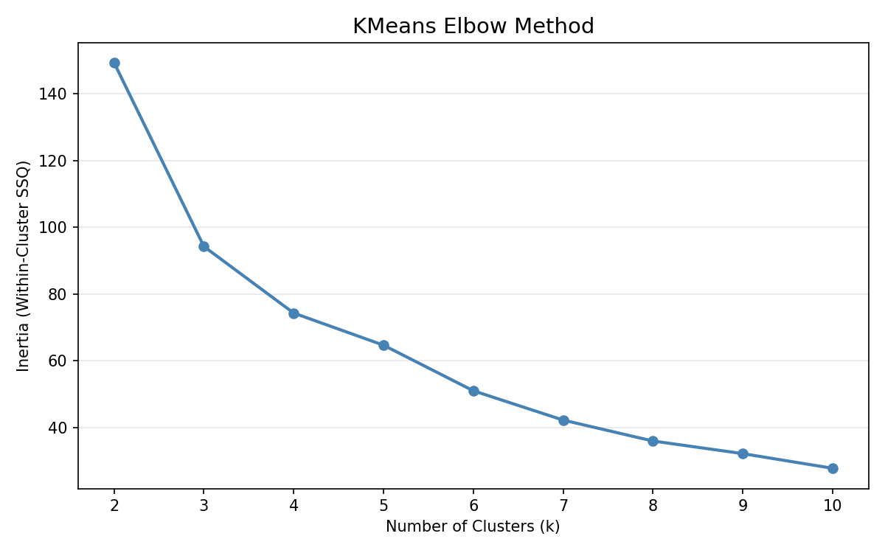

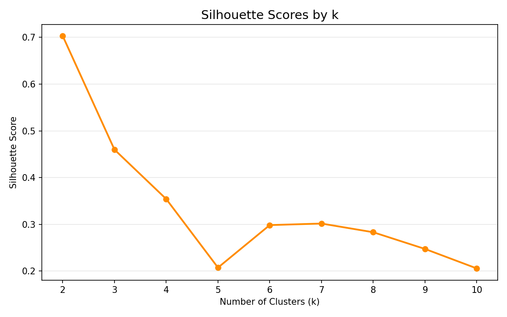

**KMeans cluster composition (k=4)**

| Cluster                     | Countries                                                                                                                                                                                                  | Avg GCI | Avg Internet % | Avg HDI | Avg GDP/capita |
| --------------------------- | ---------------------------------------------------------------------------------------------------------------------------------------------------------------------------------------------------------- | ------- | -------------- | ------- | -------------- |
| 0 - High performing         | Australia, Belgium, Brazil, Canada, Denmark, Estonia, Finland, France, Germany, Italy, Japan, Netherlands, Norway, Poland, Portugal, Singapore, South Korea, Spain, Sweden, Turkey, UK, USA (22 countries) | 97.1    | 92.4%          | 0.92    | $48,334        |
| 1 - Outlier                 | Argentina (1 country)                                                                                                                                                                                      | 50.1    | 89.2%          | 0.85    | $14,262        |
| 2 - Lower income developing | Ghana, India, Kenya, Nigeria (4 countries)                                                                                                                                                                 | 87.7    | 50.8%          | 0.60    | $2,249         |
| 3 - Mid-tier mixed          | Austria, China, Czech Republic, Hungary, Israel, Mexico, South Africa, Switzerland (8 countries)                                                                                                           | 86.3    | 88.4%          | 0.86    | $37,006        |

Cluster 0 groups the 22 highest-performing countries and is notable for its high average GCI score (97.1) and very high internet penetration (92.4%). Cluster 2 groups the four lower-income African and Asian countries in the dataset; despite relatively strong GCI scores in some cases (average 87.7), their internet penetration (50.8%) and HDI (0.60) are much lower, indicating that connectivity and human development remain the main constraints on cybersecurity readiness. Cluster 3 is the most heterogeneous group, containing both high-income countries with policy gaps (Switzerland, Austria) and middle-income countries with strong institutional frameworks (China, Israel).

**Hierarchical clustering**

Hierarchical clustering was run using Ward linkage, which minimises the total within-cluster variance at each merge step. The dendrogram confirms the four-cluster structure found by KMeans and shows Argentina separating first as its own branch, followed by the lower-income group (Cluster 2), before the main body of countries splits into the high-performing and mid-tier groups.

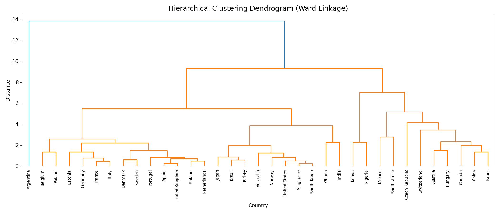

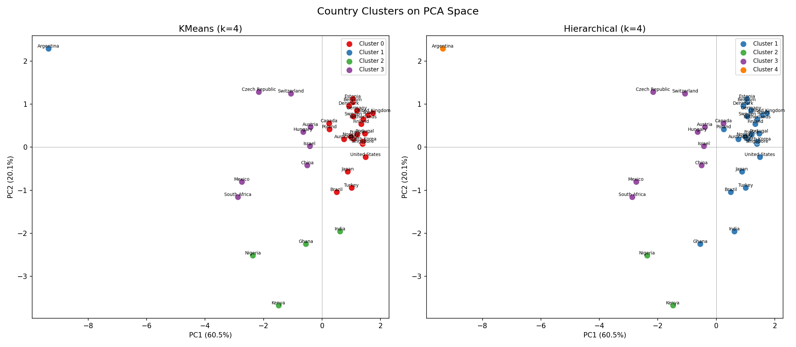

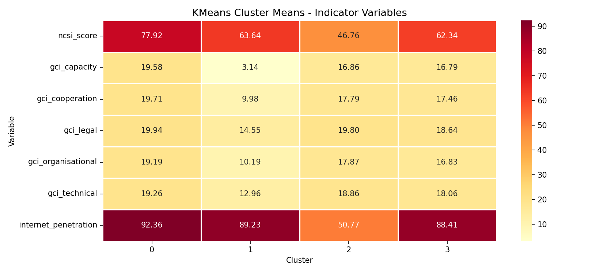

**Alignment with the theoretical framework**

The four clusters broadly confirm the structure assumed by the theoretical framework. The high-performing cluster (Cluster 0) contains the countries expected to lead on all four CRI dimensions. The developing-country cluster (Cluster 2) has strong legal frameworks in some cases but limited technical capacity, which the framework would predict given lower infrastructure investment. The mid-tier cluster (Cluster 3) is the most interesting: it includes wealthy countries like Switzerland and Austria that underperform on the legal sub-index, and middle-income countries like China that score well on organisational measures but lower on technical capacity. Argentina as a singleton cluster confirms the outlier status identified during the normalisation stage. Overall, the data-driven clusters align well with the sub-index groupings defined in Section 1.2.

### 4.4 Variable Selection Decision

Based on the correlation analysis, one variable was removed from the indicator set before building the CRI:

- **ddl_score was removed** because it has a Pearson correlation of r = 0.869 with internet_penetration. Including both would effectively double-count internet connectivity in the Technical Capacity sub-index.

- **gci_overall was retained as a benchmark only** and not included in any sub-index, because it is already a composite of the five GCI pillars that form the core of the CRI. Including it as an indicator would introduce circularity.

All other variables (internet_penetration, gci_technical, ncsi_score, gci_legal, gci_capacity, gci_organisational, gci_cooperation) were kept and assigned to the four sub-indices.

---

## 5. Normalisation

### 5.1 Method: Min-Max Scaling

Min-max normalisation was applied to all indicator variables before aggregation. This rescales each variable to the range [0, 1] using:

```
x_norm = (x - x_min) / (x_max - x_min)
```

A score of 1 means the country has the highest value in the dataset for that variable. A score of 0 means the lowest. This makes all variables directly comparable regardless of their original units.

### 5.2 Why Min-Max and Not Z-Score?

Z-score standardisation (used in PCA) centres values around zero and allows negative scores, which is less intuitive for a public-facing index. Min-max scaling is used in major composite indicators including the UN HDI and the NCSI itself, and produces scores that are easy to interpret: higher is always better.

One important consideration with min-max scaling is that it is sensitive to outliers. A single country with an extreme low value becomes the anchor of the scale (score = 0), compressing the scores of all other countries into a smaller range. In this dataset, Argentina has GCI pillar scores that are dramatically lower than all 34 other countries. For example, Argentina's gci_capacity score is 3.1 compared to a median of around 93 for the rest of the dataset. This makes Argentina the unintended minimum benchmark in several sub-indices. The consequence is that all other countries cluster in a relatively narrow band near the top of the scale, which is visible in the sub-index distribution plots. This is documented as a known limitation of the index.

All indicator variables are also negatively skewed after the min-max transformation, which reflects the influence of Argentina's low values pulling the minimum down. The skewness values for the raw GCI pillar variables range from -2.3 to -3.4, all well above the |1.0| threshold typically used to flag distributional issues. This skewness was checked and documented but no transformation was applied, as transforming the data would distort the meaning of the normalised scores.

---

## 6. Weighting and Aggregation

### 6.1 Sub-Index Aggregation

Each of the four sub-indices was calculated as the simple (equal-weighted) mean of its normalised constituent variables:

| Sub-Index               | Variables Included                              |
| ----------------------- | ----------------------------------------------- |
| Technical Capacity      | internet_penetration, gci_technical, ncsi_score |
| Legal and Regulatory    | gci_legal                                       |
| Capacity Building       | gci_capacity                                    |
| Organisational Measures | gci_organisational, gci_cooperation             |

### 6.2 Final CRI Score

The final CRI score is a weighted average of the four sub-indices with equal weights (0.25 each):

```
CRI = 0.25 * Technical Capacity
    + 0.25 * Legal and Regulatory
    + 0.25 * Capacity Building
    + 0.25 * Organisational Measures
```

Equal weighting was chosen because there is no strong empirical or theoretical basis for prioritising one dimension of cybersecurity readiness over another. This is consistent with the approach taken by the ITU GCI and the OECD Handbook, which recommend equal weighting as the default when expert judgement is not available.

The arithmetic mean (additive aggregation) was used, which allows full compensability between sub-indices. This means a country with a very strong score in one dimension can offset a weak score in another. For example, a country with excellent technical infrastructure but weak legislation would still receive a moderate overall score. This is a deliberate design choice that is consistent with how the ITU GCI and other major indices aggregate their components.

### 6.3 Results

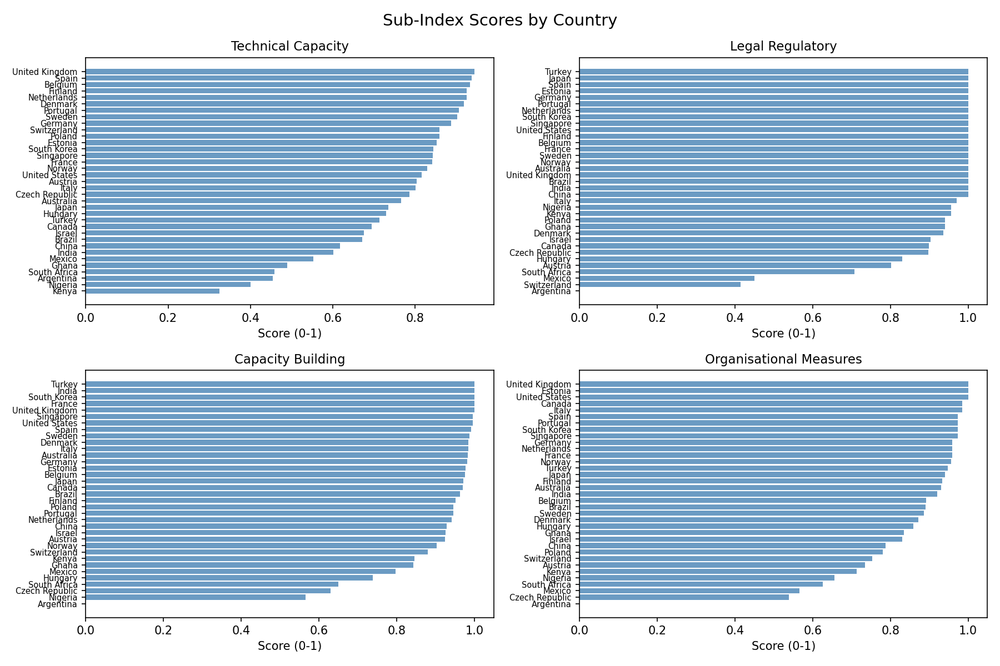

The final CRI scores and rankings for all 35 countries are shown below:

| Rank | Country        | CRI Score | Technical Capacity | Legal/Regulatory | Capacity Building | Organisational |
| ---- | -------------- | --------- | ------------------ | ---------------- | ----------------- | -------------- |
| 1    | United Kingdom | 0.986     | 0.944              | 1.000            | 1.000             | 1.000          |
| 2    | Spain          | 0.976     | 0.937              | 1.000            | 0.992             | 0.974          |
| 3    | Estonia        | 0.957     | 0.853              | 1.000            | 0.977             | 1.000          |
| 4    | Germany        | 0.957     | 0.887              | 1.000            | 0.982             | 0.959          |
| 5    | Portugal       | 0.957     | 0.907              | 1.000            | 0.947             | 0.974          |
| 6    | Netherlands    | 0.957     | 0.925              | 1.000            | 0.942             | 0.959          |
| 7    | South Korea    | 0.955     | 0.845              | 1.000            | 1.000             | 0.974          |
| 8    | Singapore      | 0.953     | 0.843              | 1.000            | 0.996             | 0.974          |
| 9    | United States  | 0.953     | 0.816              | 1.000            | 0.996             | 1.000          |
| 10   | Finland        | 0.953     | 0.925              | 1.000            | 0.952             | 0.934          |
| 11   | Belgium        | 0.950     | 0.934              | 1.000            | 0.976             | 0.892          |
| 12   | France         | 0.950     | 0.842              | 1.000            | 1.000             | 0.959          |
| 13   | Sweden         | 0.944     | 0.902              | 1.000            | 0.987             | 0.886          |
| 14   | Italy          | 0.935     | 0.801              | 0.970            | 0.985             | 0.985          |
| 15   | Denmark        | 0.928     | 0.919              | 0.936            | 0.985             | 0.871          |
| 16   | Norway         | 0.923     | 0.830              | 1.000            | 0.904             | 0.957          |
| 17   | Australia      | 0.920     | 0.766              | 1.000            | 0.983             | 0.931          |
| 18   | Turkey         | 0.915     | 0.713              | 1.000            | 1.000             | 0.948          |
| 19   | Japan          | 0.912     | 0.736              | 1.000            | 0.972             | 0.941          |
| 20   | Canada         | 0.887     | 0.694              | 0.899            | 0.970             | 0.985          |
| 21   | Poland         | 0.882     | 0.860              | 0.941            | 0.947             | 0.781          |
| 22   | Brazil         | 0.881     | 0.671              | 1.000            | 0.963             | 0.890          |
| 23   | India          | 0.881     | 0.602              | 1.000            | 1.000             | 0.921          |
| 24   | Israel         | 0.834     | 0.676              | 0.903            | 0.927             | 0.831          |
| 25   | China          | 0.833     | 0.617              | 1.000            | 0.929             | 0.787          |
| 26   | Austria        | 0.817     | 0.804              | 0.803            | 0.925             | 0.735          |
| 27   | Hungary        | 0.789     | 0.730              | 0.831            | 0.738             | 0.859          |
| 28   | Ghana          | 0.777     | 0.490              | 0.941            | 0.843             | 0.834          |
| 29   | Switzerland    | 0.727     | 0.860              | 0.415            | 0.880             | 0.753          |
| 30   | Czech Republic | 0.713     | 0.787              | 0.898            | 0.629             | 0.538          |
| 31   | Kenya          | 0.710     | 0.325              | 0.956            | 0.846             | 0.713          |
| 32   | Nigeria        | 0.645     | 0.400              | 0.956            | 0.566             | 0.656          |
| 33   | South Africa   | 0.611     | 0.459              | 0.708            | 0.650             | 0.626          |
| 34   | Mexico         | 0.591     | 0.553              | 0.450            | 0.798             | 0.566          |
| 35   | Argentina      | 0.114     | 0.455              | 0.000            | 0.000             | 0.000          |

---

## 7. Links to Other Indices

### 7.1 Comparison with ITU GCI

The ITU Global Cybersecurity Index is the closest existing index to the CRI. Both measure national cybersecurity capacity across legal, technical, and organisational dimensions. A high Pearson correlation between the two would provide validation that the CRI is capturing the same underlying phenomenon.

The Pearson correlation between the CRI score and GCI overall score is **r = 0.961 (p < 0.001)**. This is a very strong positive correlation, confirming that the CRI is measuring the same underlying construct as the GCI. This is expected given that the CRI is built largely from GCI pillar scores. The high correlation validates that the index is internally consistent and tracking real cybersecurity readiness rather than noise.

### 7.2 Comparison with HDI

The UN Human Development Index measures general development (health, education, income). If the CRI correlates strongly with HDI, it would suggest the index is partly measuring general wealth and development rather than cybersecurity-specific factors.

The Pearson correlation between the CRI and HDI is **r = 0.429 (p = 0.010)**. This is statistically significant but moderate in strength. The CRI-HDI correlation is substantially weaker than the CRI-GCI correlation (0.961 vs 0.429), which is evidence that the CRI is capturing cybersecurity-specific signal rather than just general development level.

The correlation between CRI and GDP per capita is **r = 0.406 (p = 0.016)**, similarly moderate, suggesting that wealthier countries do tend to score higher on the CRI but that wealth alone does not determine a country's cybersecurity readiness score.

### 7.3 Multiple Linear Regression

A Multiple Linear Regression was run with CRI score as the dependent variable and GCI score, HDI score, and GDP per capita as independent variables.

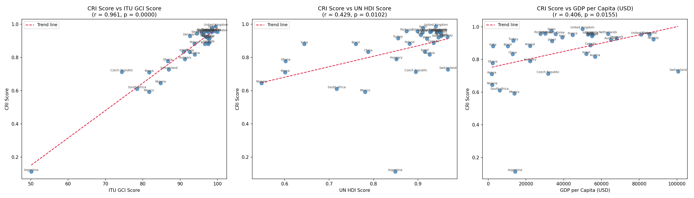

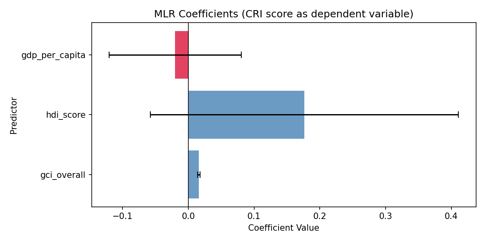

**Model summary:**

| Statistic          | Value   |
| ------------------ | ------- |
| R-squared          | 0.931   |
| Adjusted R-squared | 0.925   |
| F-statistic        | 140.2   |
| F p-value          | < 0.001 |
| Observations       | 35      |

**Coefficient p-values:**

| Predictor      | Coefficient | p-value | Significant? |
| -------------- | ----------- | ------- | ------------ |
| gci_overall    | 0.0160      | < 0.001 | Yes (\*\*\*) |
| hdi_score      | 0.1764      | 0.135   | No           |
| gdp_per_capita | -0.0201     | 0.685   | No           |

The model explains 93.1% of the variance in CRI scores (R-squared = 0.931). The only statistically significant predictor is gci_overall (p < 0.001). After controlling for the GCI score, neither HDI (p = 0.135) nor GDP per capita (p = 0.685) adds significant explanatory power. This means the CRI is not being driven by general wealth or development level once the cybersecurity-specific GCI signal is accounted for. This is a positive result for the validity of the index: it suggests the CRI is measuring cybersecurity readiness, not just economic development.

The high R-squared (0.931) also reflects the fact that the CRI draws heavily on GCI pillar scores as its input variables, so a strong relationship with the GCI overall score is expected by construction.

---

## 8. Visualisation of Results

### 8.1 Top 20 Countries by CRI Score

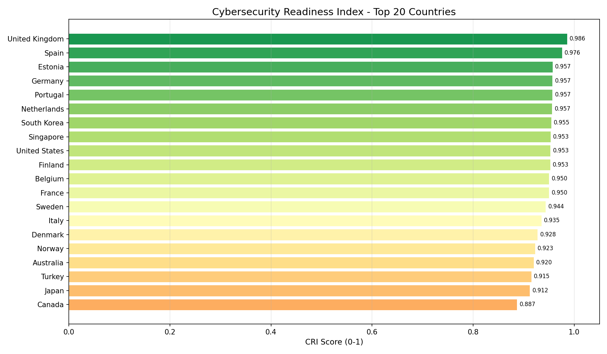

The top 20 countries are all high-income nations with well-established digital infrastructure and mature cybersecurity governance frameworks. The United Kingdom ranks first with a CRI score of 0.986, driven by perfect scores in the Legal/Regulatory, Capacity Building, and Organisational sub-indices. Estonia, despite being a much smaller country than Germany or the United States, ranks third (0.957) on the strength of its long-standing investment in digital governance and national cybersecurity infrastructure. Spain ranks second (0.976), performing strongly across all four sub-indices.

The spread of scores in the top 20 is relatively narrow, with most countries falling between 0.88 and 0.99. This compressed range is partly a consequence of the min-max normalisation anchoring the minimum at Argentina's very low GCI pillar scores.

### 8.2 All 35 Countries by CRI Score

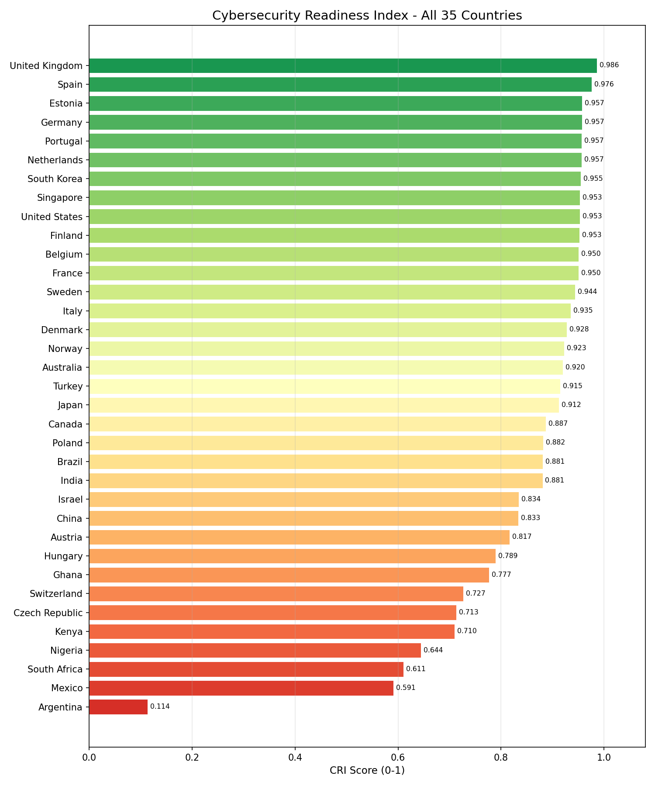

Looking at all 35 countries, a clear gap opens up between the top cluster and the lower-ranked countries. Mexico (rank 34, score 0.591) and Argentina (rank 35, score 0.114) stand out as significantly below the rest. Argentina's low score is primarily because its GCI pillar scores are far below all other countries in the dataset, resulting in scores of 0.000 in the Legal/Regulatory, Capacity Building, and Organisational sub-indices after normalisation.

Countries like Kenya (rank 31, score 0.710), Nigeria (rank 32, score 0.645), and South Africa (rank 33, score 0.611) score lower than the high-income group but still achieve moderate scores, mainly because they score relatively well on the Legal/Regulatory sub-index, indicating that basic legal frameworks are in place even if technical and organisational capacity lags behind.

### 8.3 Sub-Index Scores by Country

The grouped bar chart below shows how each country performs across the four sub-indices, making it possible to identify where strengths and weaknesses lie:

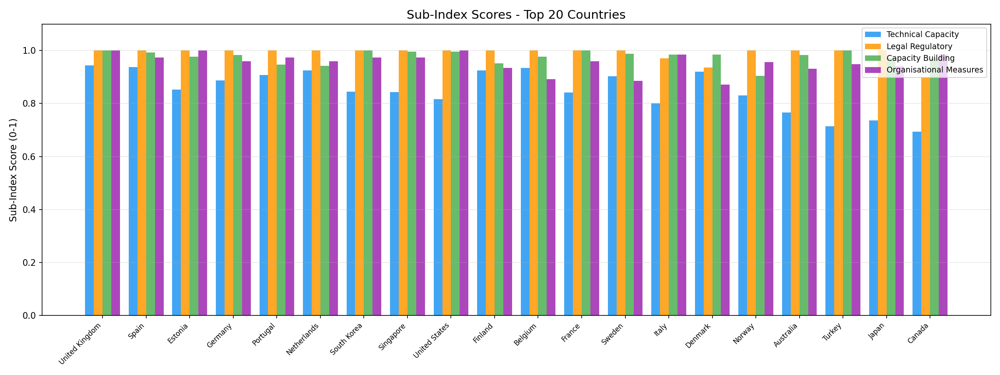

### 8.4 Sub-Index Heatmap

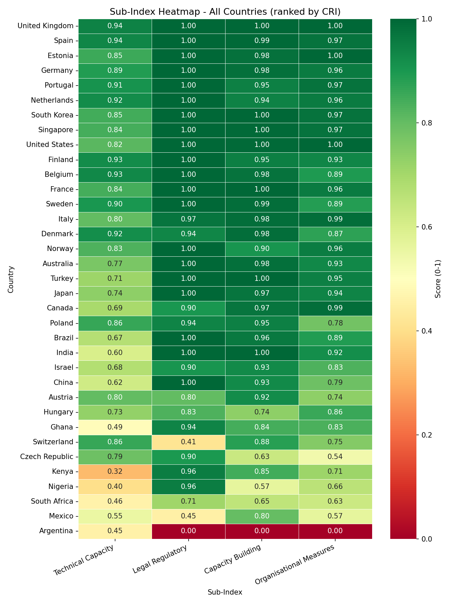

The heatmap shows that Legal/Regulatory is the sub-index where most countries perform well: 24 out of 35 countries score 0.90 or above. This reflects that having legislation in place is a relatively low bar compared to actually implementing technical systems or building workforce capacity.

Technical Capacity shows the most variation across the dataset. Kenya scores only 0.325, while the United Kingdom scores 0.944. This sub-index is the one most closely linked to economic development, since building digital infrastructure requires sustained investment over many years.

Switzerland is an interesting outlier: it ranks 29th overall despite being one of the wealthiest countries in the dataset, primarily because of a very low Legal/Regulatory score (0.415). This reflects its gci_legal pillar score from the 2024 ITU GCI, which is substantially below peer nations and may indicate gaps in legislation or enforcement during the reference period.

### 8.5 World Map

The choropleth map shows CRI scores geographically. Darker green indicates higher readiness. Grey countries are not included in the dataset.

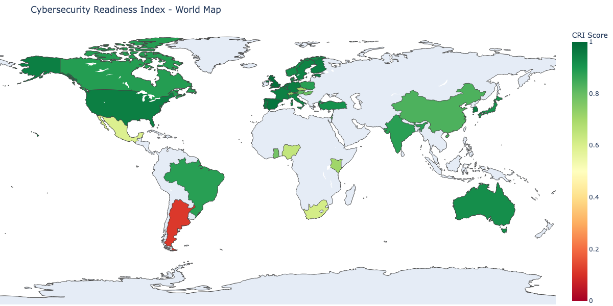

The geographic distribution shows a clear pattern: European countries and the Asia-Pacific cluster (Singapore, South Korea, Japan, Australia) dominate the upper end of the scale. African countries in the dataset (Ghana, Kenya, Nigeria, South Africa) fall in the middle-to-lower range. South America is represented only by Argentina, Brazil, and Mexico, which span a wide range from near-bottom (Argentina) to upper-mid (Brazil at rank 22).

### 8.6 Radar Chart - Top 5 Countries

The radar chart compares the top 5 countries across all four sub-indices simultaneously:

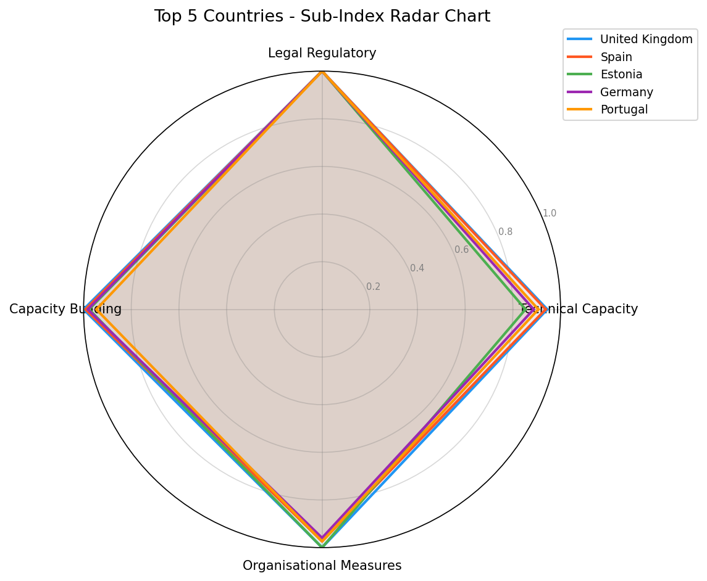

The radar chart makes it clear that the top 5 countries (United Kingdom, Spain, Estonia, Germany, Portugal) all perform near-maximally across all four dimensions. The main differentiator between them is Technical Capacity, where scores range from 0.853 (Estonia) to 0.944 (United Kingdom). All five countries score 1.000 on Legal/Regulatory, meaning they all have the strongest legal frameworks in the dataset.

---

## 9. Conclusion

The Cybersecurity Readiness Index produced a complete ranking of 35 countries across four sub-indices: Technical Capacity, Legal and Regulatory Framework, Capacity Building, and Organisational Measures. The United Kingdom ranked first with a score of 0.986, followed by Spain (0.976) and Estonia (0.957). Argentina ranked last with a score of 0.114, a result driven entirely by its GCI pillar scores being far below every other country in the dataset.

The sub-index with the greatest variation across countries was Technical Capacity (standard deviation = 0.170, range = 0.325 to 0.944). Legal/Regulatory showed the least variation among the top 30 countries, with most scoring near the maximum, but Argentina's zero score on that sub-index pulled the overall spread up. This suggests that in most countries basic legislation is in place, but investment in technical infrastructure and human capital remains uneven.

The CRI correlates very strongly with the ITU GCI (r = 0.961, p < 0.001), which validates that the index is measuring a real and consistent construct. The moderate correlation with HDI (r = 0.429) and GDP per capita (r = 0.406) shows that general economic development does influence cybersecurity scores, but it does not determine them entirely. Countries like Turkey (rank 18) and India (rank 23) score higher than their GDP per capita would predict, while Switzerland (rank 29) scores lower, showing that policy and governance choices matter independently of wealth.

The multiple linear regression confirmed this: after controlling for the GCI score, HDI and GDP per capita were both non-significant (p = 0.135 and p = 0.685 respectively). The model as a whole explains 93.1% of the variance in CRI scores, which is expected given that the CRI is built from GCI pillar scores.

There are some limitations to note. First, Argentina acts as an unintended minimum benchmark in the min-max normalisation, compressing scores for all other countries. If Argentina were removed, the remaining 34 countries would spread out across a wider range and the index would be more discriminating in the mid-to-lower range. Second, equal weighting was used across sub-indices and within sub-indices, which is a simplification. A future version could explore expert-weighted or data-driven weighting schemes. Third, the Legal/Regulatory sub-index relies entirely on one GCI pillar (gci_legal), which means it reflects the ITU's assessment methodology directly rather than providing an independent measure.

Despite these limitations, the CRI provides a clear and reproducible ranking that captures different dimensions of cybersecurity readiness and shows meaningful variation across countries of different income levels and regions.

---

## 10. Acknowledgements

AI tools (specifically Claude by Anthropic) were used during parts of this project in accordance with the assessment brief, which permits their use with appropriate acknowledgement.

**AI assistance was used for the following:**

**1. Fixing a Plotly rendering error in notebook 07**

When running the choropleth map cell, the following error appeared:

```
ValueError: Mime type rendering requires nbformat>=4.2.0
```

AI identified that `fig.show()` was trying to render inline without the required nbformat version. The suggested fix was to remove `fig.show()` and instead save the figure with `pio.write_image()`, then display the saved PNG using matplotlib:

```python
pio.write_image(fig_map, map_path, width=1200, height=600)
img = plt.imread(map_path)
fig, ax = plt.subplots(figsize=(14, 7))
ax.imshow(img)
ax.axis('off')
plt.show()
```

**2. Statsmodels OLS regression syntax**

The correct way to add a constant and run OLS regression with statsmodels was looked up with AI assistance:

```python
X_const = sm.add_constant(X)
model = sm.OLS(y, X_const).fit()
print(model.summary())
```

**3. Silhouette score syntax for KMeans evaluation**

The `silhouette_score` import and usage alongside KMeans was suggested by AI:

```python
from sklearn.metrics import silhouette_score
for k in range(2, 11):
    km = KMeans(n_clusters=k, random_state=42, n_init=10)
    labels = km.fit_predict(X_scaled)
    sil = silhouette_score(X_scaled, labels)
    print(f'k={k}: silhouette={sil:.4f}')
```

**4. Generating the Word document**

The JavaScript code used to produce the Word report with embedded figures, tables, and page formatting was written with AI assistance using the docx npm library.

**The following was done independently without AI assistance:**

- The choice of index topic (cybersecurity readiness) and the decision to focus on European and comparable nations
- The selection of data sources and the decision to use GCI pillar scores as the core variables
- All analytical decisions including which variables to keep or drop, the choice of k=4 for clustering, equal weighting across sub-indices, and the interpretation of results
- Running and executing all notebooks and verifying the outputs
- The overall structure of the project and the mapping of variables to sub-indices

All data was sourced directly from the original providers listed in Section 2. No data was generated or fabricated by AI tools.

---

## 11. References

- Nardo, M., Saisana, M., Saltelli, A., Tarantola, S., Hoffman, A., & Giovannini, E. (2008). _Handbook on Constructing Composite Indicators: Methodology and User Guide_. OECD Publishing.
- e-Governance Academy (2023). _National Cyber Security Index_. https://ncsi.ega.ee
- International Telecommunication Union (2024). _Global Cybersecurity Index 2024_. https://www.itu.int
- World Bank (2023). _World Development Indicators_. https://data.worldbank.org
- United Nations Development Programme (2023). _Human Development Report 2023_. https://hdr.undp.org
